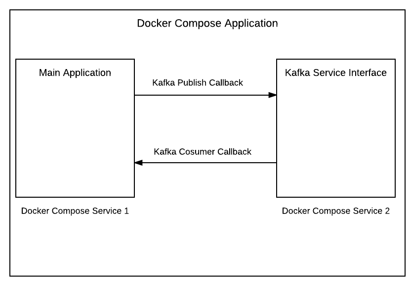

# kafka-service-interface
Docker service that exposes Kafka producer and consumer API's

This service provides an easy way to add Kafka producer and consumer API's to your application.  Communication between
this Kafka service and other docker compose services is done through http callbacks.

The officially supported Kafka client library is in Java.  Client libraries in other languages have been written but
some of then are buggy and outdated.  This approach lets you easily integrate Kafka into any other language
while getting the benefits of the officially supported client libraries.

Implementation details:
* Exposes Kafka publish callback url
* Exposes one or more Kafka consumer callback urls
* Includes failed message retries
* Includes a dead topic and callback url

## Docker Compose


## Callback Format
### Kafka Publish
```
{
    topic: 'topic.name',
    key: 'unique to spread evenly between partitions',
    message: ''
}
```
### Kafka Consumer
```
{
    topic: 'topic.name',
    key: 'unique to spread evenly between partitions',
    offset: '',
    partition: '',
    received_on: <Milliseconds since Epoch>,
    received_on_date: 'string date representation',
    value: ''
}
```
Failed messages will include:
```
{
    retries: <number of retries>,
    last_retry_on: <Milliseconds since Epoch>,
    last_retry_on_date: 'string date representation'
}
```
Dead messages will include:
```
{
    dead_on: <Milliseconds since Epoch>,
    dead_on_date: 'string date representation'
}
```

## Samples

To see how this can be added to your application see the [samples](samples) directory.

## Example Configuration
### Docker Compose
Add the Kafka Service Interface service.
```services:
     kafkaserviceinterfacesample:
       build: .
       links:
         - kafkaserviceinterface
       environment:
         # The sample will publish kafka messages to this callback url hosted by the Kafka Service Interface.
         KAFKA_PUBLISH_URL: 'http://kafkaserviceinterface:8080/kafka/publish'
         KAFKA_TOPIC: 'kafkaserviceinterfacesample.topic1'
         KAFKA_TOPIC_TEST: 'kafkaserviceinterfacesample.test1'

     kafkaserviceinterface:
       image: quay.io/washpost/kafka-service-interface
       volumes:
         - ./config:/config
       environment:
         app.name: 'Kafka Service Interface Node.js Sample'
         vpc: 'arc2'
         # Configuration file used to define the Kafka publisher and consumers.
         config.location: '/config/config.yml'

   version: '2'
```

### config.yml
The config.yml file is used to configure the Kafka producer and consumers
```
kafka:
  host: "kafka.arc2.nile.works"
  port: "9092"
kafka.producer:
  # Other services will call this endpoint to publish to Kafka.  http:<service name>:8080/kafka/publish
  publish.path: "/kafka/publish"
  port: 8080
  properties:
    client.id: "test"
    acks: "1"
    retries: "5"
    retry.backoff.ms: "1000"
    reconnect.backoff.ms: "1000"
    key.serializer: "org.apache.kafka.common.serialization.StringSerializer"
    value.serializer: "org.apache.kafka.common.serialization.StringSerializer"
    batch.size: "32000"
    linger.ms: "10"
kafka.consumers:
  -
    topics: "kafkaserviceinterfacesample.topic1"
    # For this consumer, when messages are read from Kafka, this endpoint will be called.
    callback.url: "http://kafkaserviceinterfacesample:3000/kafka-consumption-callback"
    # If the endpoint above fails the message will be put on this (optional) topic.
    failure.topic: "kafkaserviceinterfacesample.failure1"
    # Failed messages will be retried <failure.retries> number of times before they are moved to the <dead.topic>
    failure.retries: 3
    # Once the message has failed <failure.retries> times, it is moved to the (optional> <dead.topic>.
    dead.topic: "kafkaserviceinterfacesample.dead1"
    # Once moved to the <dead.topic> the message is also sent to this (optional) callback url.
    dead.callback.url: "http://kafkaserviceinterfacesample:3000/dead-callback"
    properties:
      group.id: "kafkaserviceinterfacesample.test"
      max.partition.fetch.bytes: "1000000"
      enable.auto.commit: "false"
      key.deserializer: "org.apache.kafka.common.serialization.StringDeserializer"
      value.deserializer: "org.apache.kafka.common.serialization.StringDeserializer"
```